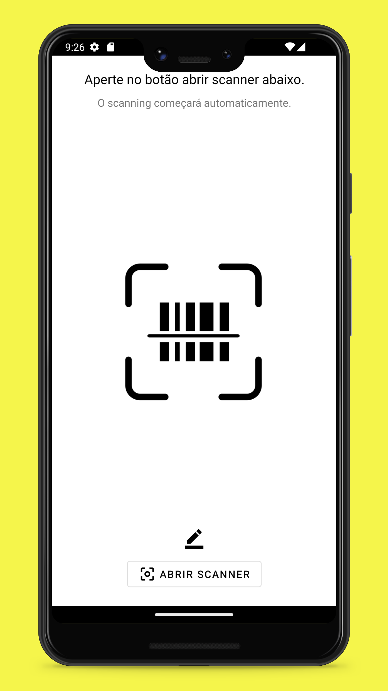
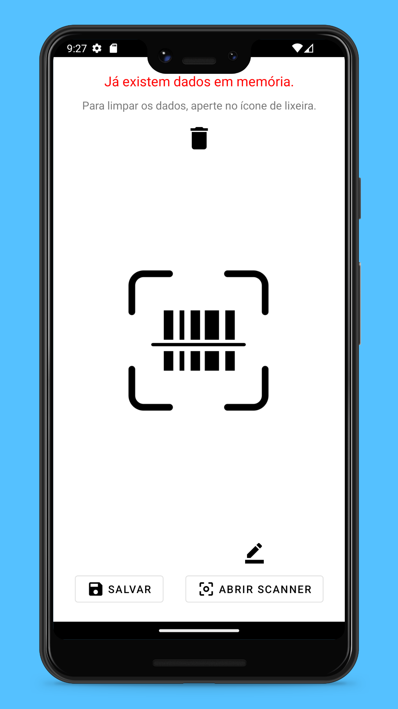
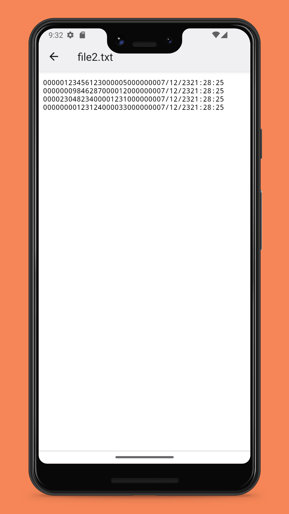
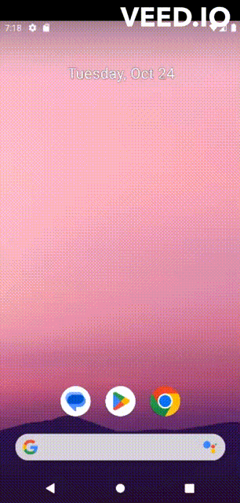

# COLETOR

  
   
 

## HOW IT WORKS?

 

## ABOUT THIS PROJECT 

The idea of the app is: 

_Make your phone a scanner device to help you with daily work_

This app reads barcodes and convert data in a .txt file, wich can be used to count the quantity of existing items in your store/company. 
It is usually used on automation softwares like Linx autosystem, that counts with a stock management by file. 
This app can also be used in others softwares depending of the way how the program reads the file.

## WHY?

An app designed for scanning barcodes drastically improved the company's operational efficiency, leading to a 30% cost reduction. This project is also a part of my personal portfolio, so, feel free if you want to check the source code and provide me any feedback about the project,
structure or anything that you can report that could make me a better developer!

Email: contactaladinjr@gmail.com

Connect me at: [Linkedin](https://www.linkedin.com/in/aladinjunior/)

## INSTALLERS

If you want to test or use the app in Production mode, send me a message on Linkedin or email me! :)

## FUNCTIONALITIES

- Your phone camera as a qrcode or barcode reader.
- Saves all the data readed in any directory you want.
- Cache system (if you close the app while reading, he stores the data, so you can kepp scanning without losing any data).
